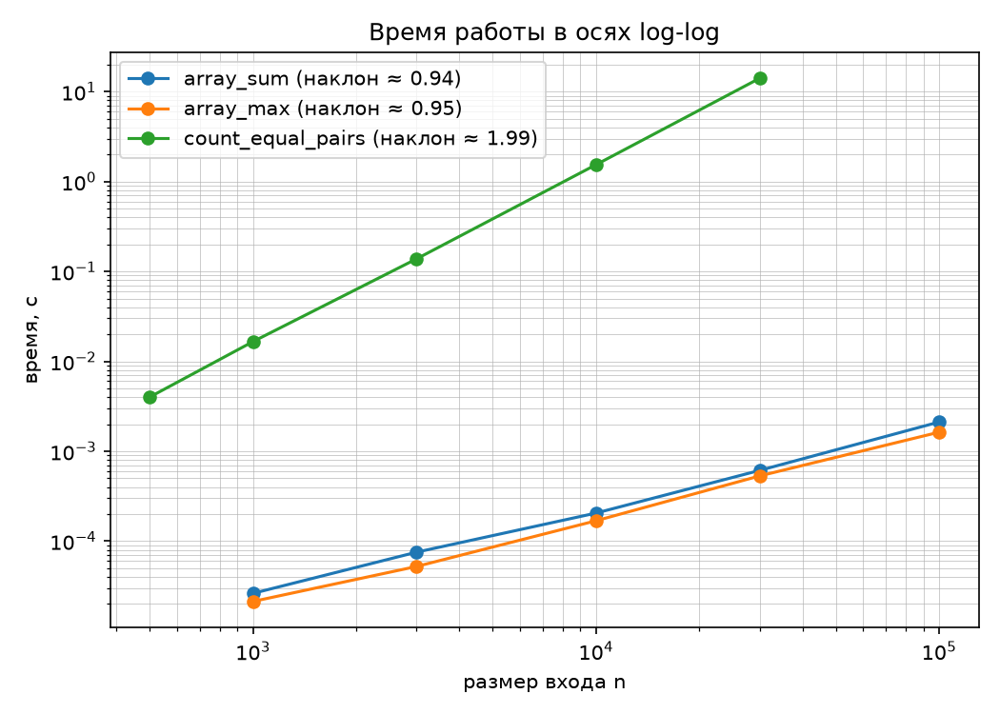
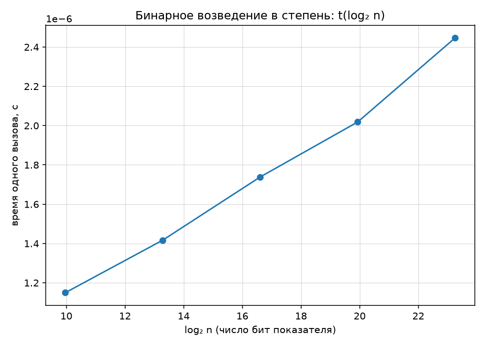

# ЛР 1. Анализ временной сложности элементарных алгоритмов

**Вариант:** 13
**Дата:** 1.10.2026

## 1. Аналитические оценки

| Алгоритм | Оценка | Обоснование |
|---|---|---|
| array_sum | O(n) | один проход по массиву |
| array_max | O(n) | один проход |
| count_equal_pairs | O(n²) | двойной цикл: для каждого i перебираем все j > i |
| binary_pow | O(log n) | n уменьшается вдвое на каждой итерации |

## 2. Результаты замеров

### array_sum (O(n))

| n | t, с |
|---|---|
| 1 000 | 0.000026 |
| 3 000 | 0.000075 |
| 10 000 | 0.000205 |
| 30 000 | 0.000612 |
| 100 000 | 0.002111 |

### array_max (O(n))

| n | t, с |
|---|---|
| 1 000 | 0.000021 |
| 3 000 | 0.000052 |
| 10 000 | 0.000168 |
| 30 000 | 0.000531 |
| 100 000 | 0.001627 |

### count_equal_pairs (O(n²))

| n | t, с |
|---|---|
| 500 | 0.004001 |
| 1 000 | 0.016554 |
| 3 000 | 0.138121 |
| 10 000 | 1.539327 |
| 30 000 | 14.092325 |

### binary_pow (O(log n)), 20 000 вызовов на точку, по модулю 1 000 000 007

| n | log₂ n | t одного вызова, с |
|---|---|---|
| 1 000 | 10.0 | 0.000001150 |
| 10 000 | 13.3 | 0.000001417 |
| 100 000 | 16.6 | 0.000001739 |
| 1 000 000 | 19.9 | 0.000002018 |
| 10 000 000 | 23.3 | 0.000002447 |

### Наклоны log-log

| Алгоритм | Наклон | Теоретическая оценка |
|---|---|---|
| array_sum | 0.944 | 1 |
| array_max | 0.955 | 1 |
| count_equal_pairs | 1.989 | 2 |

## 3. Графики

## 4. Сопоставление теории и практики

Наклоны array_sum и array_max (0.94–0.95) близки к 1,
count_equal_pairs (1.99) — к 2. Небольшое занижение
объясняется накладными расходами интерпретатора на малых n.

Для binary_pow в осях t(log₂ n) наблюдается линейный рост,
что подтверждает O(log n).

## 5. Верификация

- Граничные случаи: пустой массив, один элемент, все равны.
- Сверка с эталоном sum/max/pow на 200 случайных массивах.
- Инварианты: порядок не важен, все отрицательные, все разные, 1^n = 1.

## Заключение

В ходе лабораторной работы были реализованы четыре алгоритма:
сумма элементов массива, поиск максимума, подсчёт пар равных
элементов и бинарное возведение в степень. Для каждого алгоритма
выведена аналитическая оценка сложности в худшем случае.

Экспериментальные замеры на данных варианта 13 (seed=43) подтвердили
теоретические оценки:

- `array_sum` — O(n), наклон log-log 0.944;
- `array_max` — O(n), наклон log-log 0.955;
- `count_equal_pairs` — O(n²), наклон log-log 1.989;
- `binary_pow` — O(log n), линейный рост t(log₂ n).

Небольшие расхождения между теорией и экспериментом (наклоны 0.94–0.96
вместо 1.0) объясняются накладными расходами интерпретатора Python и
влиянием кэша процессора на малых размерах входа. Для квадратичного
алгоритма эти эффекты незаметны, поскольку рост времени при больших n
определяется самой сложностью алгоритма.

Отдельно отмечено, что для логарифмического алгоритма график в осях
log-log неинформативен: зависимость t = c · log n в этих осях не
является прямой. Поэтому для `binary_pow` использованы линейные оси
по log₂ n, в которых логарифмическая зависимость становится линейной.
Замер выполнялся по модулю 1 000 000 007, чтобы исключить влияние
длинной арифметики Python на результат.

Все реализации проверены на репрезентативных тестах (пустой массив,
один элемент, все элементы равны) и сверены с эталонными реализациями
`sum`, `max`, `pow`. Зафиксированы инварианты: независимость суммы от
порядка элементов, поведение максимума на отрицательных числах,
отсутствие пар на массиве из различных элементов, равенство единицы
в любой степени.

Цель работы достигнута: аналитические оценки подтверждены
экспериментально, расхождения объяснены.